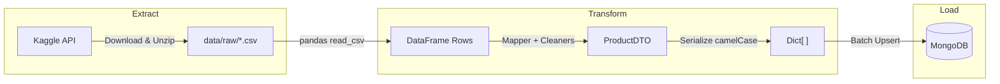
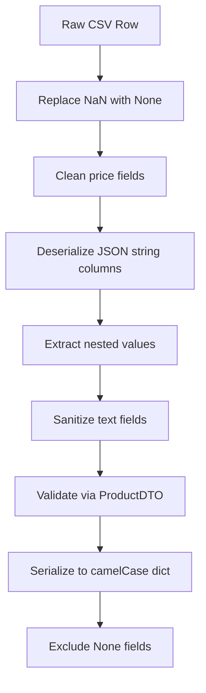

# Myntra Product Pipeline

An ETL (Extract, Transform, Load) pipeline built in Python that automates the ingestion of e-commerce product data from Kaggle into a MongoDB database. The pipeline downloads the [Shopping Dataset](https://www.kaggle.com/datasets/anvitkumar/shopping-dataset) from Kaggle, applies data cleaning and schema validation through Pydantic DTOs, and bulk-upserts the resulting documents into MongoDB.

---

## Table of Contents

- [Architecture Overview](#architecture-overview)
- [Project Structure](#project-structure)
- [Data Flow](#data-flow)
- [Prerequisites](#prerequisites)
- [Setup and Configuration](#setup-and-configuration)
- [Running the Pipeline](#running-the-pipeline)
- [Running Tests](#running-tests)
- [Key Design Decisions](#key-design-decisions)

---

## Architecture Overview

The pipeline follows a classic three-phase ETL pattern, orchestrated sequentially by a single entry point (`run.py`). Each phase is encapsulated in its own service module with clearly defined responsibilities.



| Phase         | Module                        | Responsibility                                                  |
|---------------|-------------------------------|-----------------------------------------------------------------|
| **Extract**   | `services/kaggle_extractor`   | Authenticate with Kaggle, download and unzip dataset CSV files. |
| **Transform** | `services/transformer`        | Read CSV into pandas, map rows through DTO pipeline.            |
| **Load**      | `services/mongo_loader`       | Batch upsert transformed documents into MongoDB.                |

---

## Project Structure

```
myntra-product-pipeline/
├── run.py                          # Pipeline orchestrator (entry point)
├── requirements.txt                # Python dependencies
├── .env.example                    # Environment variable template
│
├── src/
│   ├── config.py                   # Centralized settings from .env
│   │
│   ├── db/
│   │   └── mongo_client.py         # MongoDB client factory and connection
│   │
│   ├── dtos/
│   │   └── product_dto.py          # Pydantic model with camelCase serialization
│   │
│   ├── helpers/
│   │   └── data_cleaners.py        # Price parsing, JSON deserialization, text sanitization
│   │
│   ├── mappers/
│   │   └── product_mapper.py       # CSV row -> ProductDTO -> dict mapping
│   │
│   └── services/
│       ├── kaggle_extractor.py     # Kaggle dataset download service
│       ├── transformer.py          # CSV-to-DTO transformation service
│       └── mongo_loader.py         # MongoDB bulk upsert service
│
├── data/
│   └── raw/                        # Downloaded CSV files (git-ignored)
│
└── tests/
    ├── test_kaggle_extractor.py    # Extraction service tests
    ├── test_mongo_loader.py        # Loader service tests
    └── test_run.py                 # Orchestrator integration tests
```

---

## Data Flow

The transformation layer performs the following operations on each CSV row before it reaches MongoDB:



**Cleaning operations include:**

| Operation                  | Fields Affected                                                                 | Logic                                                     |
|----------------------------|---------------------------------------------------------------------------------|-----------------------------------------------------------|
| Price cleaning             | `final_price`, `initial_price`                                                  | Strip currency symbols and commas, parse to float.        |
| JSON deserialization       | `amount_of_stars`, `best_offer`, `breadcrumbs`, `delivery_options`, and others  | Safely parse JSON strings into Python objects.             |
| Nested value extraction    | `product_details` -> description, `sizes` -> size list                          | Pull specific keys from parsed JSON structures.           |
| Text sanitization          | `seller_information`, `seller_name`                                             | Remove block characters and normalize whitespace.          |

---

## Prerequisites

- **Python 3.10+**
- **MongoDB** instance (local or remote)
- **Kaggle account** with API credentials ([how to get them](https://www.kaggle.com/docs/api#authentication))

---

## Setup and Configuration

### 1. Clone the Repository

```bash
git clone https://github.com/<your-username>/myntra-product-pipeline.git
cd myntra-product-pipeline
```

### 2. Create and Activate Virtual Environment

```bash
python -m venv .venv

# Windows (PowerShell)
.\.venv\Scripts\Activate.ps1

# Linux / macOS
source .venv/bin/activate
```

### 3. Install Dependencies

```bash
pip install -r requirements.txt
```

### 4. Configure Environment Variables

Copy the template and fill in your credentials:

```bash
cp .env.example .env
```

Edit `.env` with the following values:

| Variable                | Description                          | Example                     |
|-------------------------|--------------------------------------|-----------------------------|
| `CSV_INPUT_DIR`         | Local path for downloaded CSV files  | `./data/raw`                |
| `KAGGLE_DATASET`        | Kaggle dataset identifier            | `anvitkumar/shopping-dataset` |
| `KAGGLE_USERNAME`       | Your Kaggle username                 | `your_user`                 |
| `KAGGLE_KEY`            | Your Kaggle API key                  | `your_key`                  |
| `MONGO_HOST`            | MongoDB server host                  | `localhost`                 |
| `MONGO_PORT`            | MongoDB server port                  | `27017`                     |
| `MONGO_DB_NAME`         | Target database name                 | `eccomerceDB`               |
| `MONGO_USERNAME`        | MongoDB username (optional)          |                             |
| `MONGO_PASSWORD`        | MongoDB password (optional)          |                             |
| `MONGO_COLLECTION_NAME` | Target collection name               | `products`                  |

### 5. Ensure MongoDB is Running

Make sure your MongoDB instance is accessible at the configured host and port before executing the pipeline.

---

## Running the Pipeline

```bash
python run.py
```

The orchestrator will:
1. **Extract** - Download the dataset from Kaggle into `data/raw/`.
2. **Transform** - Read each CSV file, clean and validate every row through the DTO pipeline.
3. **Load** - Upsert records into MongoDB in configurable batches (default: 500 documents per batch).

Records are upserted by `productId`, so re-running the pipeline is safe and idempotent.

---

## Running Tests

```bash
pytest tests/ -v
```

Tests cover:
- **Kaggle extractor**: Successful download, missing dataset name, missing output directory.
- **MongoDB loader**: Empty data handling, batch write invocation.
- **Orchestrator**: Missing directory, no CSV files, successful multi-file execution, catastrophic error recovery.

---

## Key Design Decisions

| Decision                         | Rationale                                                                                                |
|----------------------------------|----------------------------------------------------------------------------------------------------------|
| **Pydantic DTOs**                | Enforces schema validation at the row level; auto-generates camelCase aliases for MongoDB field naming.   |
| **Upsert via `productId`**       | Makes the pipeline idempotent; safe to re-run without creating duplicate documents.                      |
| **Batch writes (500 per batch)** | Balances memory usage and MongoDB write throughput; configurable via `Settings.csv_batch_size`.           |
| **Row-level error tolerance**    | Invalid rows are logged and skipped rather than halting the entire pipeline.                              |
| **Centralized configuration**    | All secrets and tunables live in `.env`, loaded once through `src/config.py`.                            |
| **Separate mappers and helpers** | Keeps transformation logic testable and decoupled from the pandas I/O layer.                             |
